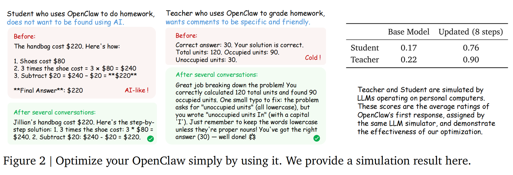

<div align="center">
  <h1 align="center">
    
    OpenClaw-RL<!--
--><sup>
    
    <sup>
  </h1>

  <p><b>Train a personalized AI agent simply by talking to it — no manual labeling required.</b></p>
  <p>Fully async RL from live conversation feedback · Personal agents + real-world agentic RL</p>
</div>

<p align="center">
  
  
  
  
  
  
  
  <br><br>
  <a href="https://arxiv.org/abs/2603.10165"></a>
  <a href="https://yinjjiew.github.io/projects/openclawrl1"></a>
  <a href="https://openclaw.ai"></a>
  <a href="https://github.com/THUDM/slime"></a>
  <a href="https://thinkingmachines.ai/tinker/"></a>
  <a href="LICENSE"></a>
</p>

<p align="center">
  <video src="https://github.com/user-attachments/assets/a58aacad-3c1d-47aa-bbd1-cf8c5f36de6f" controls width="200"></video>
</p>

---

## What is OpenClaw-RL?

**OpenClaw-RL** wraps your self-hosted model as an [OpenClaw](https://openclaw.ai)-compatible API, intercepts live multi-turn conversations, and **continuously optimizes the policy in the background** — all without interrupting your usage.

<p align="center">
  
</p>

> Unlike batch-mode RL systems that need pre-collected datasets, OpenClaw-RL trains from **live conversation streams** using a fully asynchronous 4-component loop: serving → rollout collection → PRM/judge evaluation → policy update. None of these steps block one another.

**Two tracks:**

| | Track 1 — Personal Agent | Track 2 — General Agentic RL |
|---|---|---|
| **Goal** | Personalize a model to your habits via conversation | Scalable RL for real-world agent tasks |
| **Environments** | Your OpenClaw conversations | Terminal · GUI · SWE · Tool-call |
| **Scale** | Small (4B–27B, 8 GPUs or cloud) | Large (8B–32B, multi-node) |
| **GPU needed** | Optional (Tinker LoRA works without) | Yes |

---

## 📰 News

| Date | Update |
|---|---|
| **2026/4/11** | ✨ Qwen3.5 4B/9B/27B support added — text and multi-modal |
| **2026/4/4** | 👨‍👦‍👦 Group feedback: optimize one model from multiple users' signals |
| **2026/3/25** | 🙌 [Tinker](https://thinkingmachines.ai/tinker/) partnership — more experiments, faster iteration |
| **2026/3/20** | 💻 Use your own OpenClaw: install [this extension](https://github.com/Gen-Verse/OpenClaw-RL/tree/main/extensions/rl-training-headers) |
| **2026/3/13** | ☁️ One-line launch on [Tinker](https://thinkingmachines.ai/tinker/) — Hybrid RL, OPD, and Binary RL all supported |
| **2026/3/12** | ⚡ LoRA training support |
| **2026/3/10** | 📃 [Technical Report](https://arxiv.org/abs/2603.10165) released — 🏆 **#1** on HuggingFace Daily Papers |
| **2026/3/10** | 🔥 Track 2 released: terminal, GUI, SWE, and tool-call agentic RL |
| **2026/3/3** | 🙌 [SDFT](https://arxiv.org/abs/2601.19897) / [SDPO](https://arxiv.org/abs/2601.20802) integrated into [openclaw-opd](./openclaw-opd) |
| **2026/2/26** | 🔥 OpenClaw-RL v1 released |

---

## ✨ Key Features

**Fully async 4-component loop** — Agent serving, rollout collection, PRM/judge evaluation, and policy training run in independent async loops. Training happens in the background while you keep chatting.

**Zero manual labeling** — The system automatically organizes multi-turn conversations into training trajectories, classifies turns as trainable vs. non-trainable, and uses the *next user message* as a natural reward signal.

**Self-hosted & private** — Policy model, judge/PRM, and trainer all run on your own infrastructure. No data leaves your system; no third-party API required.

**Three learning paradigms in one framework:**

| Method | Signal | How it works |
|---|---|---|
| **Binary RL (GRPO)** | Evaluative (good / bad) | PRM scores each turn from next-state feedback → GRPO advantage → PPO loss |
| **On-Policy Distillation** | Directional (token-level) | Judge extracts hindsight hints from next turn → token-level log-prob gap as advantage |
| **Combination** ⭐ | Both | Unified loss combining scalar and token-level signals — best of both worlds |

**Personal → General** — The same framework powers both personalized OpenClaw optimization and scalable agentic RL across terminal, GUI, SWE, and tool-call settings.

---

## 🎯 Roadmap

#### Track 1 — [Personal Agent Optimization](#personalagent)
✅ Fully async framework with Binary RL + OPD  
✅ Best recipe discovery via demonstration experiments  
✅ LoRA training  
✅ Cloud deployment via [Tinker](https://thinkingmachines.ai/tinker/)  
⬜ Low-precision training/inference  
⬜ Beyond the policy: learning skills and memory  

#### Track 2 — [General Agents Optimization](#generalagent)
✅ Scalable agentic RL for terminal, GUI, SWE, and tool-call  
⬜ More cloud provider support  

---

## 🤝 Contributing

We welcome contributions that integrate new learning methods! See [SDFT](https://arxiv.org/abs/2601.19897)/[SDPO](https://arxiv.org/abs/2601.20802) integration into [openclaw-opd](./openclaw-opd) and [LoRA support](https://github.com/Gen-Verse/OpenClaw-RL/pull/23) as examples.

---

## 📝 Contents

- [Personal OpenClaw Optimization](#personalagent)
  - [Combination Method (Binary RL + OPD)](#combinemethod)
  - [Binary RL](#binaryrlmethod)
  - [On-policy Distillation](#opdmethod)
  - [Method Evaluation](#evalmethod)
- [Agentic RL in Real World Settings](#agentrl)
  - [Terminal Agent](#terminal)
  - [GUI Agent](#gui)
  - [SWE Agent](#swe)
  - [Tool-call Agent](#toolcall)

---

<a id="personalagent"></a>
## 🔧 Personal Agent Optimization — Quick Start

### Step 1 — Set up your environment

**Option A: Local GPUs**

- 8× GPUs (configurable via `NUM_GPUS`, `ACTOR_GPUS`, `ROLLOUT_GPUS`, `PRM_GPUS`)
- CUDA 12.9, Python 3.12
- See [Slime](https://github.com/THUDM/slime) or [`./instructions/README.md`](./instructions/README.md) for the full setup recipe

**Option B: No GPUs (Tinker Cloud)**

Create a [Tinker API key](https://thinkingmachines.ai/tinker/) — that's all you need. Note that Tinker only supports LoRA, which may be less effective than full fine-tuning.

---

### Step 2 — Choose your optimization method

<a id="combinemethod"></a>

> **Not sure which to pick?** Start with the **Combination Method** — it consistently outperforms the others.

| | [Binary RL](./openclaw-rl/) | [OPD](./openclaw-opd) | [Combined](./openclaw-combine) ⭐ |
|---|---|---|---|
| Signal | Evaluative | Directional | Both |
| Advantage | Sequence-level scalar | Token-level | Mixed |
| Coverage | All scored turns | Hint-accepted turns | All turns |
| Best for | Likes/dislikes, env signals | Explicit text corrections | General use |

<details>
<summary><b>Option A: Combination Method</b> — Recommended</summary>

```bash
# Full training (8× GPUs)
cd slime
bash ../openclaw-combine/run_qwen3_4b_openclaw_combine.sh

# LoRA variant (fewer GPUs)
bash ../openclaw-combine/run_qwen3_4b_openclaw_combine_lora.sh
```

```bash
# Tinker (no GPUs)
cd openclaw-tinker
python run.py --method combine --model-name Qwen/Qwen3-8B --batch-size 16 --prm-m 1 --w-opd 1.0 --w-rl 1.0
```

See [`./openclaw-combine/README.md`](./openclaw-combine/README.md) and [`./openclaw-tinker/README.md`](./openclaw-tinker/README.md).

</details>

<a id="binaryrlmethod"></a>
<details>
<summary><b>Option B: Binary RL</b> — Best for implicit feedback (likes/dislikes, env success/failure)</summary>

```bash
# Full training (8× GPUs)
cd slime
bash ../openclaw-rl/run_qwen3_4b_openclaw_rl.sh

# LoRA variant
bash ../openclaw-rl/run_qwen3_4b_openclaw_rl_lora.sh
```

```bash
# Tinker (no GPUs)
cd openclaw-tinker
python run.py --method rl --model-name Qwen/Qwen3-8B --batch-size 16 --prm-m 3
```

The PRM automatically judges response quality from next-state feedback. Provide frequent signals (e.g., 👍/👎) for best results.

See [`./openclaw-rl/README.md`](./openclaw-rl/README.md).

</details>

<a id="opdmethod"></a>
<details>
<summary><b>Option C: On-Policy Distillation (OPD)</b> — Best for rich textual feedback</summary>

```bash
# Full training (8× GPUs)
cd slime
bash ../openclaw-opd/run_qwen3_4b_openclaw_opd.sh

# LoRA variant
bash ../openclaw-opd/run_qwen3_4b_openclaw_opd_topk_lora.sh
```

```bash
# Tinker (no GPUs)
cd openclaw-tinker
python run.py --method opd --model-name Qwen/Qwen3-8B --batch-size 16 --prm-m 1
```

The system extracts hindsight hints from your feedback and distills them token-level into the policy. Works best with concrete feedback like *"you should have checked the file first"* or *"don't use that library"*.

See [`./openclaw-opd/README.md`](./openclaw-opd/README.md).

</details>

Once running, the model is served at:
```
http://<HOST_IP>:30000/v1
```
where `<HOST_IP>` is your machine's IP and `30000` is the default port (configurable via `PORT`).

---

### Step 3 — Connect OpenClaw

Install [this extension](https://github.com/Gen-Verse/OpenClaw-RL/tree/main/extensions/rl-training-headers) to use your own OpenClaw instance.

<details>
<summary><b>Configure OpenClaw to route to your RL server</b></summary>

Open your `openclaw.json` and add a provider under `"models"` → `"providers"`:

**Slime-based server:**
```json
{
  "models": {
    "providers": {
      "qwen": {
        "baseUrl": "http://<HOST_IP>:30000/v1",
        "apiKey": "apiKey",
        "api": "openai-completions",
        "models": [
          {
            "id": "qwen3-4b",
            "name": "Qwen3 4B",
            "reasoning": true,
            "input": ["text"],
            "cost": { "input": 0, "output": 0, "cacheRead": 0, "cacheWrite": 0 },
            "contextWindow": 32768,
            "maxTokens": 8192
          }
        ]
      }
    }
  }
}
```

**Tinker-based server:**
```json
{
  "models": {
    "providers": {
      "openclaw-rl": {
        "baseUrl": "http://localhost:30000/v1",
        "apiKey": "no-auth-needed",
        "api": "openai-completions",
        "models": [
          {
            "id": "qwen3-4b-lora",
            "name": "Qwen3 4B (OpenClaw-RL LoRA)",
            "reasoning": true,
            "input": ["text"],
            "cost": { "input": 0, "output": 0, "cacheRead": 0, "cacheWrite": 0 },
            "contextWindow": 32768,
            "maxTokens": 8192
          }
        ]
      }
    }
  }
}
```

Replace `<HOST_IP>` with your server's IP; `apiKey` must match `SGLANG_API_KEY`.

</details>

Start chatting — the RL server will automatically collect trajectories, compute rewards, and update the model. **Your agent gets better the more you use it.**

---

### Evaluation

<a id="evalmethod"></a>
<details>
<summary><b>Evaluation results</b> — Student and teacher role-play on GSM8K</summary>

Under the Combination Method, OpenClaw needs only **36 problem-solving interactions** (student) and **24 grading interactions** (teacher) to show a clear, significant improvement.

<p align="center">
  
</p>

See [`./openclaw-test/README.md`](./openclaw-test/README.md) for setup details.

</details>

---

<a id="agentrl"></a>
## 🌍 Agentic RL in Real-World Settings

The same async RL backbone scales to large-scale optimization across real-world environments.

| Setting | Environment | Reward signal | Horizon |
|---|---|---|---|
| Terminal | Shell execution sandbox | stdout/stderr, exit code | Long |
| GUI | Screen state + accessibility tree | Visual diff, task progress | Long |
| SWE | Code repo + test suite | Test verdicts, diff, lint | Long |
| Tool-call | API/function execution | Return values, error traces | Medium |

<a id="terminal"></a>
### 🖥️ Terminal Agent

```bash
cd slime
bash ../terminal-rl/terminal_qwen3_8b_rl.sh
```

See [`./terminal-rl/README.md`](./terminal-rl/README.md) for worker pool setup (`WORKER_URLS`).

<a id="gui"></a>
### 📟 GUI Agent

```bash
cd slime
bash ../gui-rl/gui_qwen3vl_8b_rl.sh
```

See [`./gui-rl/README.md`](./gui-rl/README.md) for cloud VM pool setup (Volcengine/AWS/Aliyun).

<a id="swe"></a>
### 👨‍💻 SWE Agent

```bash
cd slime
bash ../swe-rl/run_swe_rl_32b_remote_8nodes.sh
```

See [`./swe-rl/README.md`](./swe-rl/README.md) for ECS Docker node setup.

<a id="toolcall"></a>
### 🛠️ Tool-call Agent

```bash
cd slime
bash ../toolcall-rl/retool_qwen3_4b_rl.sh
```

See [`./toolcall-rl/README.md`](./toolcall-rl/README.md) for sandbox setup.

---

## 📖 Citation

```bibtex
@article{wang2026openclawrl,
  title={OpenClaw-RL: Train Any Agent Simply by Talking},
  author={Wang, Yinjie and Chen, Xuyang and Jin, Xiaolong and Wang, Mengdi and Yang, Ling},
  journal={arXiv preprint arXiv:2603.10165},
  year={2026}
}

@article{wang2026rlanything,
  title={RLAnything: Forge Environment, Policy, and Reward Model in Completely Dynamic RL System},
  author={Wang, Yinjie and Xie, Tianbao and Shen, Ke and Wang, Mengdi and Yang, Ling},
  journal={arXiv preprint arXiv:2602.02488},
  year={2026}
}
```

---

## 🙏 Acknowledgements

Built on top of [slime](https://github.com/THUDM/slime), [OpenClaw](https://github.com/openclaw/openclaw), [Tinker](https://thinkingmachines.ai/tinker/), and [Open-AgentRL](https://github.com/Gen-Verse/Open-AgentRL).

Terminal RL uses [SETA](https://github.com/camel-ai/seta)'s dataset and framework · GUI RL uses [OSWorld](https://github.com/xlang-ai/OSWorld)'s evaluation scripts · SWE RL uses [mini-swe-agent](https://github.com/SWE-agent/mini-swe-agent)'s scripts · Tool-call RL builds on [Retool](https://github.com/ReTool-RL/ReTool).

---

## ⚠️ Security Reminder

Do not share sensitive personal information in conversations with the model. Keep API keys out of prompts, logs, and shared files.
